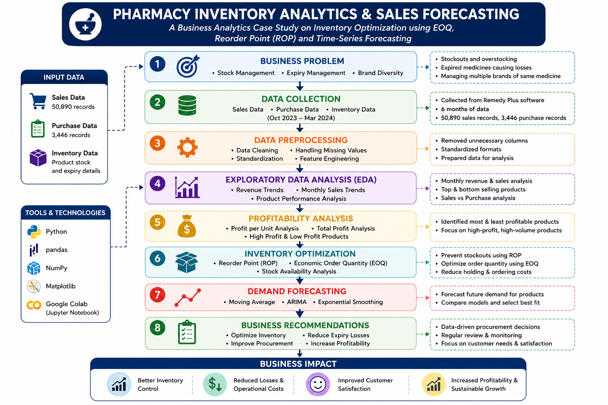
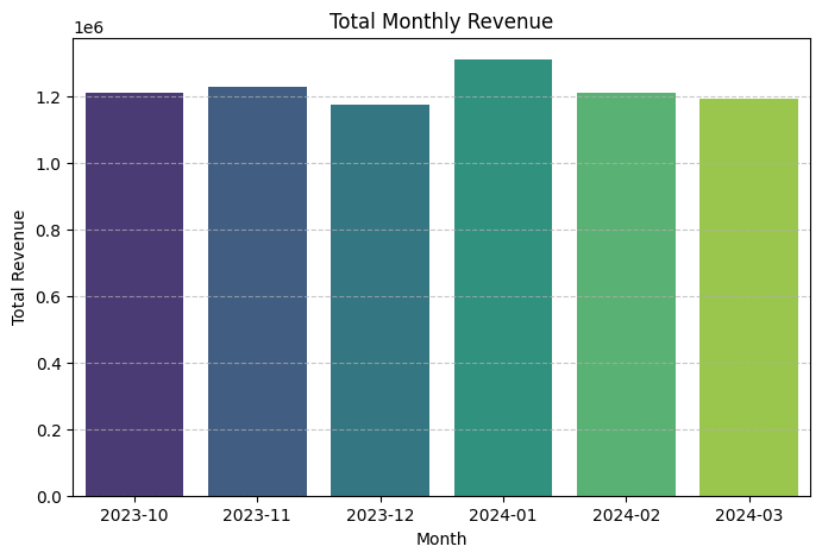
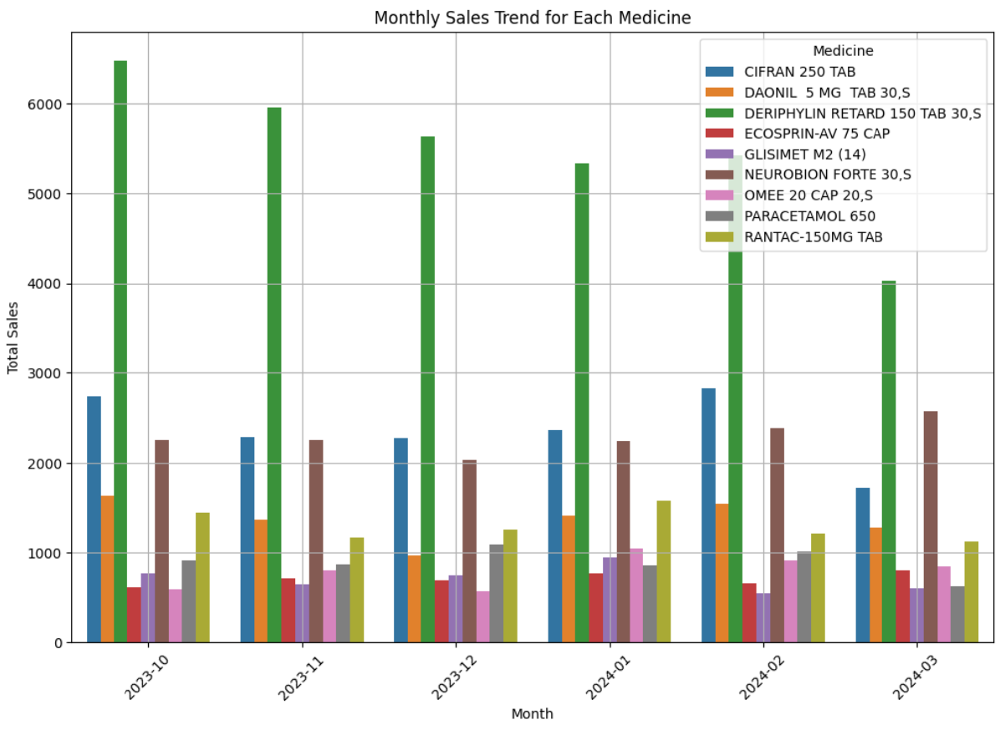
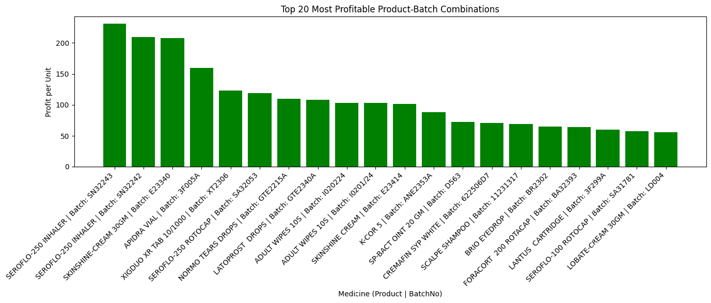
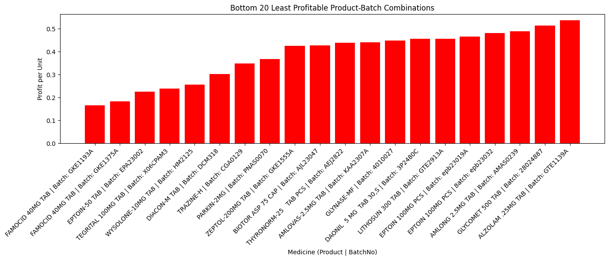
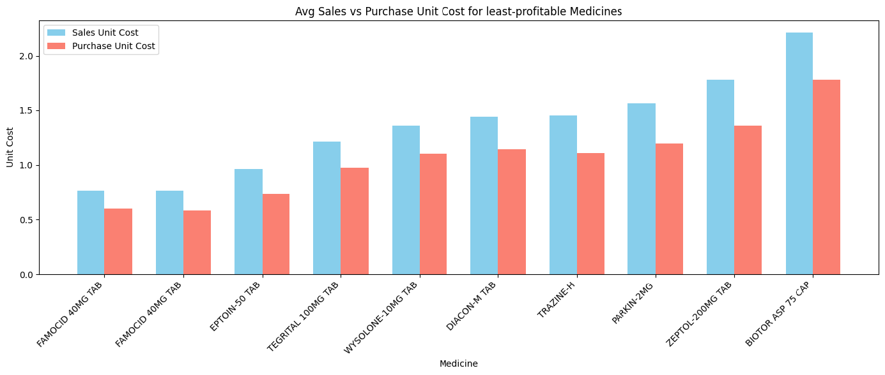
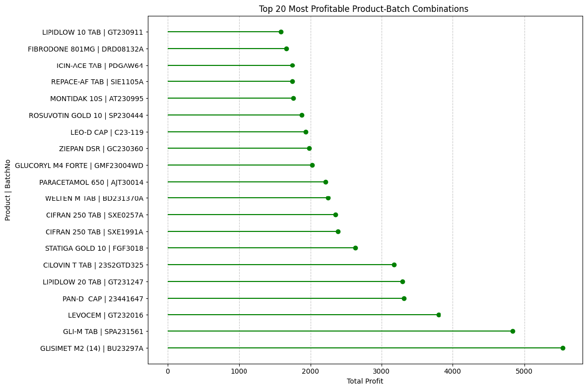
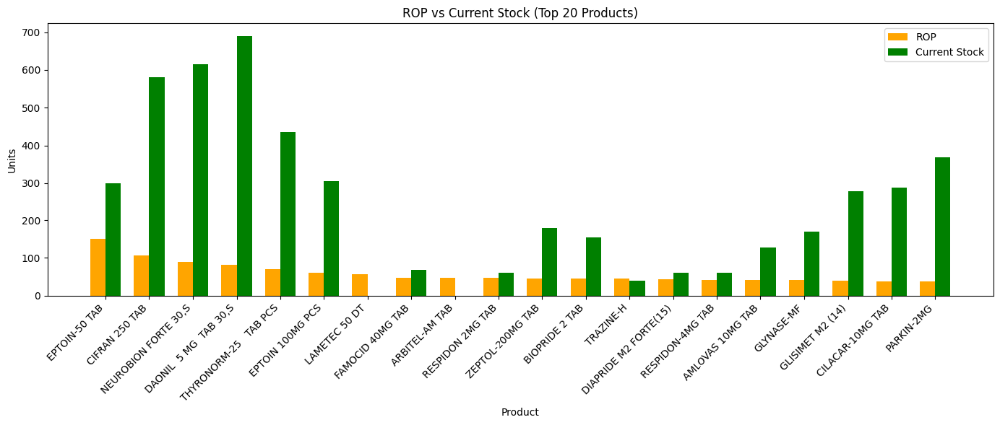
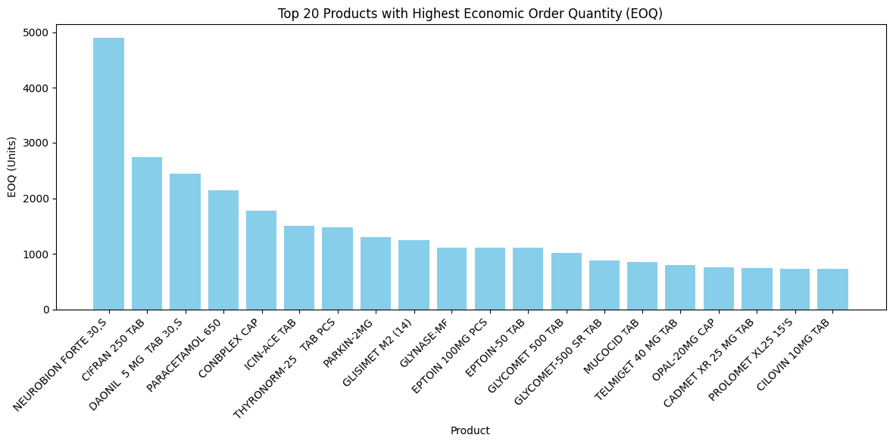
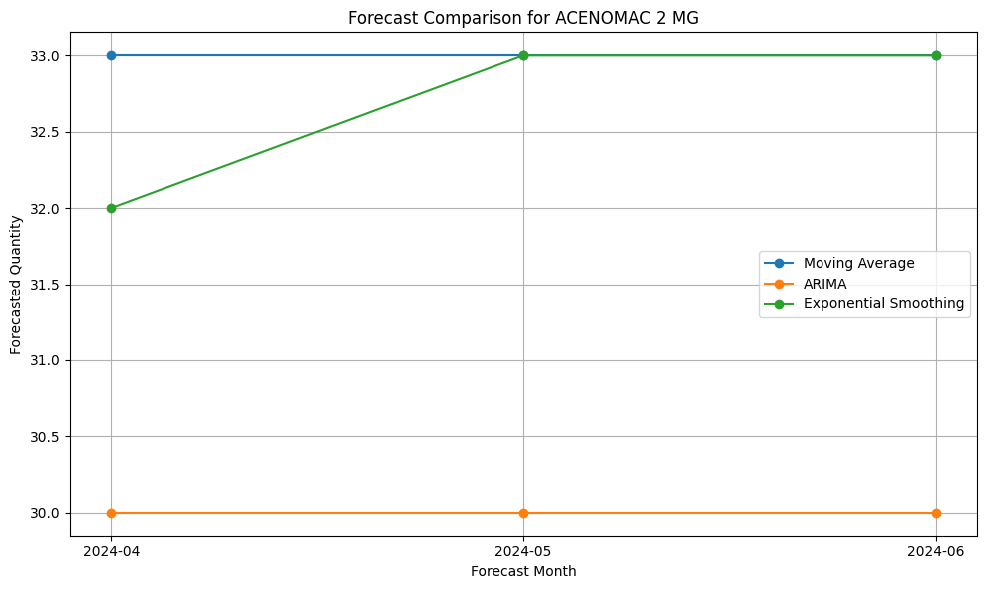

# 💊 Pharmacy Inventory Analytics & Sales Forecasting

<p align="center">
  
</p>

<p align="center">
  
  
  
  
</p>

---

# 📌 Project Overview

Efficient inventory management is essential for pharmacies to ensure medicine availability while minimizing excess stock, expiry losses, and operational costs.

This project presents a **Business Analytics Case Study** conducted for **Janananma Pharmacy**, Mannarkkad, Kerala. By analysing six months of sales, purchase, inventory, and expiry data, the project identifies opportunities to improve inventory planning, optimize procurement decisions, and forecast future medicine demand.

The analysis combines **business intelligence, inventory optimization, and time-series forecasting** to support data-driven decision-making.

---

# 🎯 Business Problem

Janananma Pharmacy faced several operational challenges:

- Frequent stockouts of high-demand medicines
- Overstocking leading to unnecessary inventory costs
- Expired medicines causing financial losses
- Managing multiple brands of the same medicine
- Difficulty forecasting future demand accurately

The objective was to develop a data-driven solution that improves inventory efficiency while maintaining product availability.

---

# 🏥 About the Organization

**Janananma Medicals and Surgicals** is a retail pharmacy located in **Mannarkkad, Palakkad, Kerala**, providing prescription medicines, wellness products, surgical supplies, baby care products, and healthcare essentials.

The project was carried out using real business data collected from the pharmacy's inventory management system.

---

# 📂 Repository Structure

```text
pharmacy-inventory-analytics/

├── data/
├── images/
├── notebooks/
├── presentation/
├── reports/
└── README.md
```

---

# 🔄 Project Workflow

<p align="center">

</p>

The project follows a complete business analytics workflow:

1. Business Problem Identification
2. Data Collection
3. Data Preprocessing
4. Exploratory Data Analysis
5. Profitability Analysis
6. Inventory Optimization
7. Demand Forecasting
8. Business Recommendations

---

# 📊 Dataset

The project uses real pharmacy operational data covering six months.

### Data Sources

- Sales Data
- Purchase Data
- Inventory Data
- Expiry Data

Sample datasets are included in this repository.

The original datasets are not publicly shared because they contain confidential business information.

---

# 🧹 Data Preprocessing

Data preprocessing included:

- Cleaning missing values
- Standardizing formats
- Removing irrelevant columns
- Feature engineering
- Date conversion
- Product standardization
- Batch number standardization

The cleaned datasets were then prepared for business analysis and forecasting.

---

# 📈 Exploratory Data Analysis

The exploratory analysis focused on understanding business performance through:

- Monthly revenue trends
- Monthly sales trends
- Product demand
- Sales distribution
- Inventory behaviour

<p align="center">

</p>

<p align="center">

</p>

---

# 💰 Profitability Analysis

Profitability was analysed at both product and batch levels.

The analysis identified:

- Top profitable medicines
- Least profitable medicines
- Profit per unit
- Total profit contribution
- Sales price vs purchase price comparison

<p align="center">

</p>

<p align="center">

</p>

<p align="center">

</p>

<p align="center">

</p>

---

# 📦 Inventory Optimization

To improve stock management, two inventory models were implemented:

## Reorder Point (ROP)

Determines when products should be reordered based on historical demand.

<p align="center">

</p>

## Economic Order Quantity (EOQ)

Calculates the optimal order quantity to minimize ordering and holding costs.

<p align="center">

</p>

---

# 📉 Sales Forecasting

Future demand was forecast using three different time-series techniques:

- Moving Average
- ARIMA
- Exponential Smoothing

The models were compared using historical sales behaviour to estimate future medicine demand.

<p align="center">

</p>

---

# 📊 Key Findings

The analysis revealed several valuable business insights:

- High-demand medicines should be prioritized for inventory planning.
- Several products generated high profit through volume rather than high unit margins.
- Inventory optimization using EOQ can significantly reduce holding costs.
- ROP analysis identified products requiring immediate replenishment.
- Time-series forecasting enables better purchasing decisions and reduces stockout risk.

---

# 💼 Business Recommendations

Based on the analysis, the following recommendations were made:

- Prioritize high-profit, high-demand medicines.
- Implement EOQ for optimized purchasing.
- Monitor inventory using Reorder Point (ROP).
- Reduce overstocking and expiry losses.
- Use demand forecasting for rolling inventory planning.
- Review product performance regularly using business analytics.

---

# 🚀 Future Improvements

Potential enhancements include:

- Real-time inventory dashboard
- Power BI visualization
- Automated inventory alerts
- Supplier performance analysis
- ABC & XYZ inventory analysis
- Web-based inventory decision support system

---

# 🛠️ Technologies Used

- Python
- Google Colab
- Pandas
- NumPy
- Matplotlib
- Statsmodels
- ARIMA
- Exponential Smoothing

---

# 📄 Project Report

The complete project report is available in:

```
reports/Final_Report.pdf
```

The presentation slides are available in:

```
presentation/Project_Presentation.pptx
```

---

# 👩‍💻 Author

**Nihila Pallath**

BS in Data Science and Programming  
Indian Institute of Technology Madras

GitHub: https://github.com/NihilaPallath-ds

---

# ⭐ Acknowledgements

Special thanks to **Janananma Medicals and Surgicals** for providing the business data required to conduct this case study.
